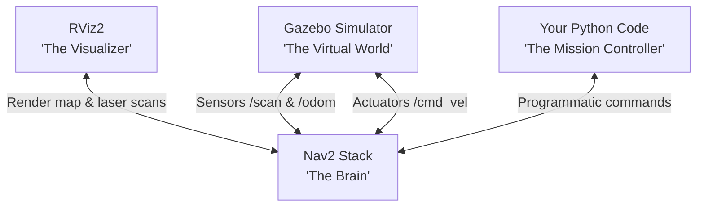

# 🕹️ ROS 2 Navigation & Simulation Sandbox

Welcome, Robot Tinkerer! This workspace is your personal playground to experiment with **Gazebo Classic Simulation** and the **Navigation2 (Nav2)** stack using a TurtleBot3 Waffle. 

There are no strict lectures here—just boot up the simulator, run the missions below, and start hacking!

---

## 🗺️ How the Sandbox Fits Together

Here is a visual map of the tools you will be running:



---

## 🚀 Setup & Launch (One-Time Setup)

### 📋 Prerequisites
Ensure your local host machine has Docker and Docker Compose installed.

To enable Gazebo and RViz graphics to show up on your screen from the Docker container, run this command in your host terminal:
```bash
xhost +local:docker
```

### 🛠️ Spinning Up the Sandbox
1. **Start the Docker container** in the background:
   * **For Intel/AMD/VM/Default setups** (Universal):
     ```bash
     docker compose up -d --build
     ```
   * **For NVIDIA GPU hardware acceleration** (Requires `nvidia-container-toolkit` on host):
     ```bash
     docker compose -f docker-compose.yml -f docker-compose.nvidia.yml up -d --build
     ```

2. **Hop into the container's shell**:
   ```bash
   docker compose exec app zsh
   ```
3. **Pull Map and Configuration files** into your workspace:
   ```bash
   ./init_workspace.sh
   ```
   *(This copies the map images and Nav2 parameter files from the container's system into your local folders, so you can edit them directly in your host IDE!)*
4. **Compile your workspace**:
   ```bash
   colcon build --symlink-install
   source install/setup.zsh
   ```

---

## 🏆 The Tinker Missions

### 🛸 Mission 1: Open the Portal (Gazebo + Nav2 + RViz)

First, let's load up the virtual world and the robot's brain.

1. **Start the Gazebo simulator** (in your first container terminal):
   ```bash
   ros2 launch ros2_nav_lecture simulation.launch.py
   ```
   *Gazebo will open, showing a TurtleBot3 Waffle in a walled room containing obstacles.*

2. **Start the Navigation Brain & RViz** (open a **second container terminal** via `docker compose exec app zsh`):
   ```bash
   ros2 launch ros2_nav_lecture navigation.launch.py
   ```
   *RViz2 will boot up, showing a 2D map. If the robot's laser scanner points do not align with the map walls:*
   * Click **"2D Pose Estimate"** at the top of RViz.
   * Click on the map near `x: -2.0, y: -0.5` (bottom-left area) and drag the green arrow to match the robot's heading in Gazebo.

---

### 🏎️ Mission 2: Programmatic Navigation (The Autopilot)

Let's tell the robot where to go using code instead of clicking on RViz.

In a **third container terminal**:
```bash
ros2 run ros2_nav_lecture simple_navigator
```
* **What happens**: The robot will programmatically localize, calculate a global path, and drive to `[x: 1.5, y: 1.5]`. The terminal will log real-time distance remaining and estimated arrival time!
* **Tinker Task**: Open [simple_navigator.py](file:///workspace/src/ros2_nav_lecture/ros2_nav_lecture/simple_navigator.py) in your IDE. Change the `goal_pose` coordinates to target one of these specific map points:
  * **The Center Plaza**: `x: 0.0, y: 0.0`
  * **The Bottom Right Room**: `x: 1.5, y: -1.0`
  * Run the command again to see the robot navigate to your new coordinates!

---

### 🛡️ Mission 3: Reactive Obstacle Dodge (Sensors to Motors)

Let's test simple raw sensor feedback without full path planners.

1. Terminate any navigation/navigator tasks running in your terminals (press `Ctrl + C`).
2. Run the reactive avoidance node:
   ```bash
   ros2 run ros2_nav_lecture obstacle_avoidance
   ```
* **How it works**: This node reads the raw Lidar data (`/scan`) in the front 60-degree arc of the robot. If something gets closer than `safe_distance`, it commands the wheels (`/cmd_vel`) to pivot. Otherwise, it cruises forward.
* **Tinker Task**: Open [obstacle_avoidance.py](file:///workspace/src/ros2_nav_lecture/ros2_nav_lecture/obstacle_avoidance.py). Try changing:
  * `safe_distance` (e.g. from `0.6` to `0.3` to make the robot super-daring around walls).
  * `linear_speed` and `angular_speed` to make it zip around like a racecar.
  * *Tip: After making changes, rebuild using `colcon build --symlink-install`.*

---

### 👮 Mission 4: The Perimeter Patrol Guard (Your Coding Challenge)

Your primary challenge is to write a waypoint-following patrolling behavior. 

1. Open [patrol_challenge.py](file:///workspace/src/ros2_nav_lecture/ros2_nav_lecture/patrol_challenge.py).
2. Complete the code inside the labeled `TODO` blocks:
   * **TODO 1**: Define at least 3 custom waypoint poses.
   * **TODO 2**: Send the robot to the current waypoint.
   * **TODO 3**: Monitor the navigation feedback.
   * **TODO 4**: Handle success (make the robot spin 360 degrees to scan the area!).
3. Recompile and run your patrol:
   ```bash
   ros2 run ros2_nav_lecture patrol_challenge
   ```
* *(Hint: If you get stuck or want to compare solutions, inspect the [patrol_challenge_solution.py](file:///workspace/src/ros2_nav_lecture/ros2_nav_lecture/patrol_challenge_solution.py) node).*

---

## 🎛️ Advanced Tinkering: Tuners & Modifiers

### 🐘 Brave vs. Cowardly Robot (Costmap Inflation)
Open [nav2_params.yaml](file:///workspace/src/ros2_nav_lecture/config/nav2_params.yaml) in your editor. Find the parameter:
`inflation_radius: 0.55` (under `global_costmap` and `local_costmap`).
* **Reduce it** to `0.2`: The robot will squeeze through tight corridors and get close to walls.
* **Increase it** to `0.8`: The robot will keep a massive distance from walls, but might get stuck because it thinks hallways are too narrow to pass!

### ⚡ Speed Demons
Under `controller_server` in [nav2_params.yaml](file:///workspace/src/ros2_nav_lecture/config/nav2_params.yaml), find:
`max_vel_x` (default `0.26`) and `max_vel_theta` (default `1.0`).
Try doubling these speeds and see how the robot handles sharp turns in simulation! Does it skid, overshoot, or navigate successfully?

---

## 🆘 Troubleshooting: Gazebo Won't Launch?

If Gazebo hangs at a black screen, crashes, or fails to open, here are the most common solutions:

### 1. The X11 Display Permission Error (Most Common)
If you see errors like `cannot open display` or `Client is not authorized to connect to Server`:
* You **must** run this command in your **host system terminal** (not inside the Docker container):
  ```bash
  xhost +local:docker
  ```
* This tells your X server to allow graphic windows originating from your local Docker containers.

### 2. GPU/Driver Mismatch (e.g. `failed to load driver: iris` or NVIDIA toolkit errors)
* **If you have an NVIDIA GPU**: Make sure you have installed the `nvidia-container-toolkit` on your host machine, and start your container using:
  ```bash
  docker compose -f docker-compose.yml -f docker-compose.nvidia.yml down
  docker compose -f docker-compose.yml -f docker-compose.nvidia.yml up -d
  ```
* **If you have an Intel or AMD GPU**: The container will run out-of-the-box using the mapped `/dev/dri` GPU devices. Run:
  ```bash
  docker compose down && docker compose up -d
  ```
* **If you are inside a Virtual Machine** or still experience rendering crashes: Open [docker-compose.yml](file:///workspace/docker-compose.yml), uncomment the software rendering line under `environment:` (line 14):
  ```yaml
  - LIBGL_ALWAYS_SOFTWARE=1
  ```
  And start/restart the container:
  ```bash
  docker compose down && docker compose up -d
  ```


### 3. Infinite Loading / Network Hang
If Gazebo Classic opens but hangs forever loading the world, it is likely trying to download models from the internet:
* We have pre-configured the local model directory. Check that your environment is sourced properly by running:
  ```bash
  echo $GAZEBO_MODEL_PATH
  ```
* It should contain `/opt/ros/humble/share/turtlebot3_gazebo/models`. If not, run:
  ```bash
  source /opt/ros/humble/setup.zsh
  ```

### 4. ROS 2 Node Discovery & TF Frame Issues
* **Node Discovery Dropouts**: The container uses **FastRTPS** (`RMW_IMPLEMENTATION=rmw_fastrtps_cpp`) and loopback isolation (`ROS_LOCALHOST_ONLY=1`) to utilize Shared Memory (SHM) segments inside Docker. This bypasses multicast restrictions on host systems.
* **Costmap TF Errors**: In ROS 2 Humble, loading the raw TurtleBot3 URDF can result in namespace placeholders (`${namespace}base_link`) that cause TF tree disconnections. In this sandbox, `simulation.launch.py` automatically strips these placeholders to match the raw frames spawned by the Gazebo SDF physics engine (`base_link`), ensuring a clean TF tree.
* **rqt_tf_tree**: Use rqt_tf_tree to debug your issues for tf trees. use
  ```bash
  sudo apt install ros-humble-rqt-tf-tree
  ros2 run rqt_tf_tree rqt_tf_tree
  ```